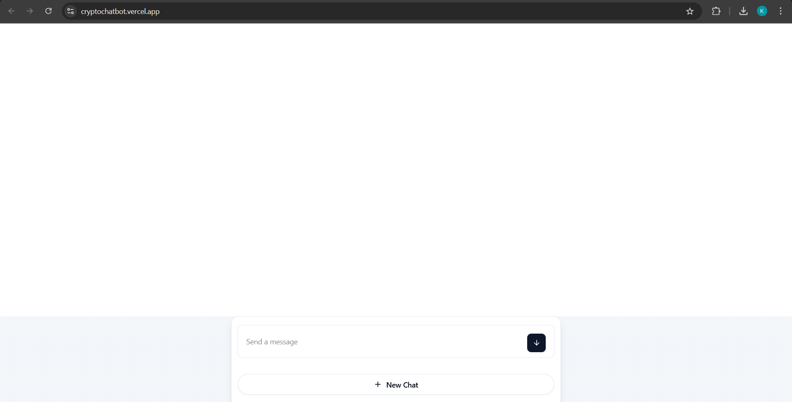
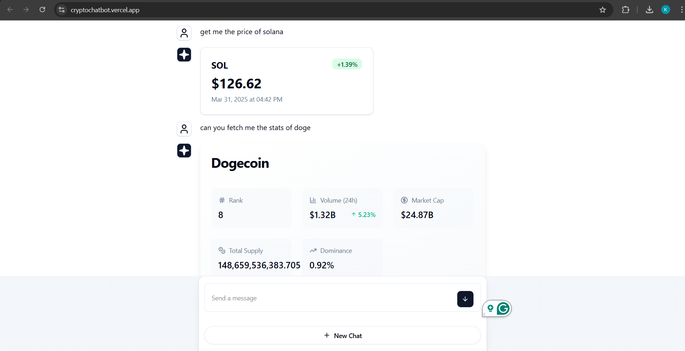
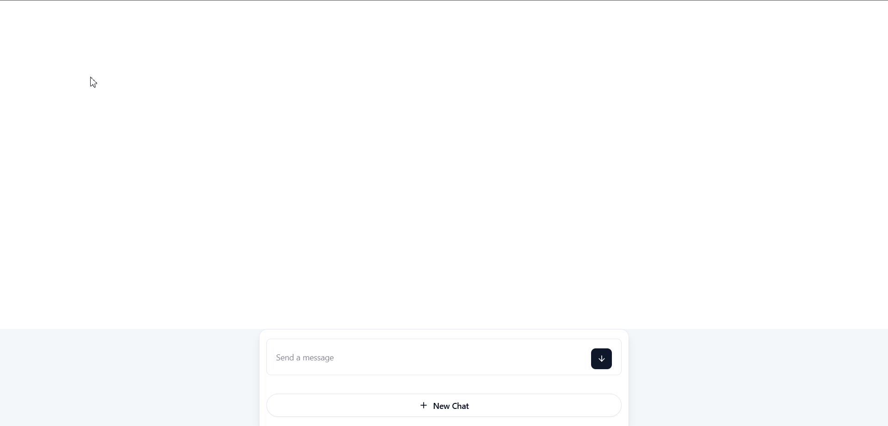

# 🚀 Crypto Chatbot - AI-Powered Crypto Assistant

CryptoChat combines the power of AI with real-time crypto market data to create a seamless, intelligent crypto companion. Whether you're a seasoned trader or crypto curious, CryptoChat provides instant access to market insights, price trends, and expert-level answers to all your crypto questions.

## ✨ Features

- 💬 AI-powered chat with crypto-specific tools
- 📊 Real-time price data from **Kraken API**
- 📈 Market stats from **CoinMarketCap API**
- ⚡ Streaming UI with **Vercel AI SDK**
- 🦾 Built with Next.js 14 React Server Components

## 🛠 Tech Stack

| Component       | Technology                     |
| --------------- | ------------------------------ |
| Framework       | React, Next.js 14 (App Router) |
| AI Engine       | Vercel AI SDK + GPT-4          |
| APIs            | Kraken, CoinMarketCap, OpenAI  |
| Styling         | Tailwind CSS + shadcn/ui       |
| Package Manager | Bun (got bored of npm)         |

## Screenshots

<div align="center">
  
  
</div>

_Live demo: [cryptochatbot.vercel.app](https://cryptochatbot.vercel.app)_

## Walkthrough vid

<div align="center">
  
</div>

## 🖥 Local Setup

### Prerequisites

- Node.js ≥18.x
- [Bun](https://bun.sh/) (recommended) or npm
- API keys:
  - [OpenAI](https://platform.openai.com/api-keys)
  - [Kraken](https://www.kraken.com/features/api)
  - [CoinMarketCap](https://pro.coinmarketcap.com/)

### Installation

1. **Fork this repo** (top-right button)  
   _or_  
   Clone directly:
   ```bash
   git clone https://github.com/your-username/crypto-chatbot.git
   ```

2)
